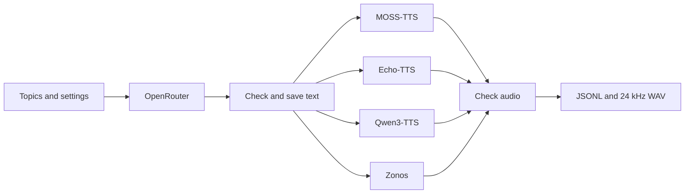

# Generate synthetic speech data

Use OpenRouter to write text. Use MOSS-TTS, Echo-TTS, Qwen3-TTS, or Zonos to turn it into speech. The result uses the same JSONL and WAV format as the training code.

The four adapters are implemented. CPU tests use mocked model APIs and test audio. Real OpenRouter responses and pretrained GPU inference still need validation.

## How it works



Each model runs in its own Python environment. The pipeline keeps one model loaded while it processes its examples, then closes it before starting the next model. This avoids mixing incompatible packages or loading all four models onto the GPU together.

Generate the text once. Reuse it for different voices, TTS models, and dataset versions. OpenRouter is used for text generation; the TTS workers run locally on your GPU.

## Choose the text type

| Type | What OpenRouter writes | Use |
| --- | --- | --- |
| `grounded_qa` | Fictional objects, colors, and places | SFT and the existing exact-answer RL reward |
| `dialogue` | Short questions and spoken answers | SFT; answers need review |

The first version supports English and single-turn examples.

For `grounded_qa`, code builds the question and copies the answer from the scene. For example:

```json
{"item": "cup", "color": "red", "place": "kitchen"}
```

This becomes:

```text
Question: In this story, the cup is red and is in the kitchen. What color is the cup? Reply with only the color.
Answer: red
```

This tests listening and recall. It is a small starting task, not a general reasoning benchmark. The LLM supplies fictional content rather than being trusted to calculate a correct answer.

Dialogue answers are not verified facts. The current RL and evaluation commands reject dialogue data because their reward expects one exact answer. Add and evaluate an open-ended reward before using dialogue for RL.

## Setup

Install the pipeline dependencies in the main repository:

```bash
uv sync --extra synthetic --extra asr --extra dev
```

Set `OPENROUTER_API_KEY` in your shell or secret manager. The code reads it from the environment. Do not put it in a config file.

Use [TTS setup](TTS_SETUP.md) to install the model workers on a Linux machine with an NVIDIA GPU that supports BF16. The current adapters use CUDA. Start with a small run on your available GPU; no VRAM or speed measurements have been made for these adapters.

## Plan a run

```bash
uv run lfm-rl synth-plan \
  --text-config configs/synthetic/text.yaml \
  --audio-config configs/synthetic/speech.yaml
```

The example plan has 100 text examples, 400 speech examples, and 800 audio clips before quality checks. Planning makes no network calls and does not load models.

For your first real run, copy the text config and set `count: 2`. In the speech config, keep only one engine. Check the results before increasing the size.

## Generate the text

```bash
uv run lfm-rl synth-text \
  --config configs/synthetic/text.yaml \
  --output data/text-v1
```

Change `model` to an OpenRouter model that supports structured outputs. The example model ID was present in OpenRouter's catalog on September 10, 2026. Availability and provider support can change.

Requests use a strict JSON schema and `provider.require_parameters: true`. Responses are also validated locally. Optional `providers` lists allowed providers in order and disables fallback outside that list. See [OpenRouter structured outputs](https://openrouter.ai/docs/guides/features/structured-outputs).

The settings control batch size, temperature, output tokens, retries, timeout, and total requests. `max_requests` includes retries and interrupted requests. Authentication and account errors stop immediately. Temporary failures get bounded retries. OpenRouter can return errors inside a successful HTTP response, which the client also checks. See [OpenRouter errors](https://openrouter.ai/docs/api_reference/errors-and-debugging).

These are request and token limits, not a hard dollar budget. Use an account or API key spending limit for that. A request that times out may still be billed, and retrying it may cost more. Actual returned usage is saved; missing usage is not counted as zero. Successful text responses are cached so speech experiments do not repeat LLM calls.

## Generate the speech

Edit `configs/synthetic/speech.yaml` to select your workers and voices. Paths are relative to the directory where you run the command. Run from the repository root for the supplied paths.

```bash
uv run lfm-rl synth-audio \
  --config configs/synthetic/speech.yaml \
  --text data/text-v1 \
  --output data/speech-v1

uv run lfm-rl validate-data data/speech-v1 --require-audio
```

The speech stage can also read text-only datasets made by the existing `data` command, including the arithmetic tasks. It does not require an OpenRouter call when the text already exists.

Both the question and answer are synthesized. This provides reference answer speech for SFT and the default RL anchor.

The example enables CPU Whisper transcription checks. Set `qa.asr_model: null` for a faster waveform-only development run. Such a run does not check whether the words were spoken correctly. The default ASR alias is not a pinned checkpoint. For controlled studies, use the same fixed local ASR model directory for every run. Whisper is an imperfect filter, especially for very short answers; inspect both accepted and rejected samples.

## Output files

```text
data/text-v1/
  run.json
  requests.jsonl
  responses/
  dataset.json
  manifest.jsonl

data/speech-v1/
  run.json
  dataset.json
  manifest.jsonl
  audio/
  native/
  clips/
  logs/
  rejected.jsonl
```

`audio/` contains mono, 24 kHz, PCM16 WAV files for training. `native/` keeps the original sample rate and channels in floating point WAV. Conversion uses a bandlimited resampler. It does not trim silence or force all clips to the same length.

The checks reject invalid samples, silence, excessive clipping, and clips outside the duration range. Optional ASR rejects clips whose word error rate exceeds the limit. A question-answer pair is included only if both clips pass. Rejected pairs are recorded, and the final count may be smaller than the plan. An entirely rejected run does not publish a dataset.

Each row keeps the source text fields, LLM response identity, requested and returned model names, TTS model and code revisions, voice settings, random seed, audio hashes, and quality results. Host package versions are recorded in `run.json`. Runtime package versions and GPU details are saved per worker. Reference audio is identified by its hash; keep the source recording separately if you need to recreate the run.

The output remains [dataset schema version 1](DATASETS.md). New information goes inside `provenance`, so existing training code can read it.

## Resume or create a new version

Rerun the same command and output path to resume. Validated text responses and accepted audio clips are reused. Hash checks detect changes to cached files. A completed dataset is validated and returned without new generation.

Changed config, source text, reference recording, implementation, or worker runtime requires a new output directory. Use names such as `text-v2` and `speech-v2`. Keep the earlier dataset for comparisons.

Only one process may write to an output directory. After a hard crash, a `.lock` file may remain. Remove it only after checking that the recorded process is no longer running. A failed or incomplete LLM response remains in `responses/` for inspection. To retry that batch, archive and remove its response file before rerunning; the earlier request still counts against the limit. Increasing the request budget requires a new run directory.

Seeds and pinned weights help track experiments. They do not guarantee identical remote LLM results or identical GPU audio across hardware and package versions.

## Compare dataset versions

The split comes from the meaning of an example, not the voice, TTS model, or version label. Every rendering of one text example stays in the same split. For color recall, the same object and place also stay together when the color changes.

This is an 80/10/10 hash split, so small datasets may have empty validation or test splits. Dialogue grouping catches normalized identical questions; it does not detect all paraphrases. Review near duplicates before making a benchmark. Speaker-held-out testing also needs a separate voice assignment policy.

Quality filters can reject different examples for different engines. For fair TTS comparisons, compare the intersection of accepted `semantic_group` values and report rejection rates for each engine. Keep the text set and QA settings fixed when measuring only a voice or TTS change.

## Model and voice terms

The code license does not license generated datasets. Each row records the TTS source and terms, and the dataset lists its output-license declarations. Keep the OpenRouter model/provider terms and any reference voice terms with a distributed dataset.

Echo-TTS states that its weights and audio outputs use **CC-BY-NC-SA-4.0**, including through its Fish S1-DAC dependency. This matters when mixing Echo audio with other sources. See the [Echo license statement](https://github.com/jordandare/echo-tts#license).

For the other engines, the code records their model license and does not invent a separate output license. Check the model and reference-recording terms for your intended use.
